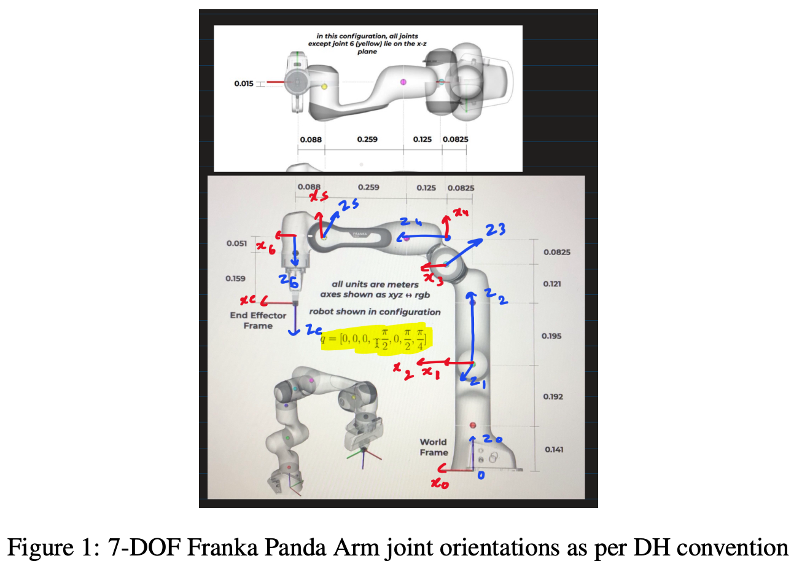
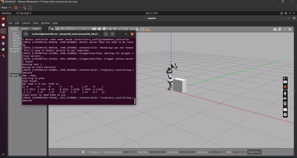

<div align="center">
<p align="center">
  
</p>
<p align="center">
    <h1 align="center">FrankaEmika_Pick_Place</h1>
</p>
</div>

## Introduction
This project represents an end to end pipeline for real-time 7 DOF robot to pick and place static and dynamic blocks using ROS and Gazebo framework. Developed motion planning using Geometric Inverse Kinematic and bi-directional RRT for tight and fast control.


### Objective:
Develop a reliable and efficient pick-and-place system.
### Technologies Used: 
Franka Emika robotic arm, Python, custom algorithms for object detection and Inverse Kinematics.


### Methodology 
Custom Algorithms for Object Detection: Advanced algorithms developed to accurately detect and identify objects, enabling the robot to distinguish between different objects for pick-and-place tasks.

Inverse Kinematics Algorithms: These algorithms calculate the necessary joint angles of the robot to achieve desired positions of the end-effector, crucial for precise manipulation of objects.

Bi-directional RRT (Rapidly-exploring Random Tree): Implemented for motion planning, this algorithm efficiently finds paths by growing trees from both start and goal configurations, ensuring fast and efficient navigation through complex spaces.

Detailed explanation in Report.
<p align="center">
  
</p>
<!--  -->

##  Repository Structure

```sh
└── FrankaEmika_Pick_Place/
    ├── labs/
    │   ├── Forward_Kinematics/
    │   │   ├── visualize.py
    │   │   └── workspace.py
    │   ├── Inverse_Kinematics/
    │   │   ├── follow.py
    │   │   └── visualize.py
    │   ├── Jacobian_Velocity_FK/
    │   │   ├── follow.py
    │   │   └── visualize.py
    │   ├── Path Planning/
    │   │   ├── potentialField_demo.py
    │   │   └── rrt_demo.py
    │   └── Pick_Place_Final/
    │       ├── Final_Blue.py
    │       ├── Final_Red.py
    │       ├── Ik_new.py
    │       └── translib.py
    ├── lib/
    │   ├── FK_velocity.py
    │   ├── IK_position_null.py
    │   ├── IK_velocity_null.py
    │   ├── Jacobian.py
    │   ├── calcAngDiff.py
    │   ├── calcManipulability.py
    │   ├── detectCollision.py
    │   ├── forwardKinematics.py
    │   ├── inverseKinematics.py
    │   ├── loadmap.py
    │   ├── potentialFieldPlanner.py
    │   └── rrt.py
    |__ Report 
```

---

##  Start to End Pipeline for Robotic Manipulator

This pipeline outlines the systematic approach employed in the FRANKAEMIKA_PICK_PLACE project, covering every critical stage from Forward Kinematics to Path Planning. Each stage is crucial and combining all maked the 7DOF robot move as desired.

### 1. Forward Kinemtaics

<!-- <details closed><summary>Forward Kinematics</summary> -->
<b>Process:</b>
Utilizing the Denavit-Hartenberg (DH) parameters to model the robot arm. Computing the transformation matrices for each joint to derive the end-effector's position and orientation.


<p align="center">
  
</p>

### 2. Jacobian and Velocity Forward 

<b>Process:</b>
Calculating the Jacobian matrix, which maps differential changes in joint angles to spatial velocity of the end-effector.
Using this Jacobian to determine the required joint velocities for desired end-effector velocities.

### 3. Inverse Kinematics  (Numerical and Geometrical Method)

<b>Process:</b>
Developed algorithms that invert the FK process to solve for joint angles from a given end-effector pose using the numerical gradient descent method as well as geometrical IK. Addressing the complexity arising from the arm's multiple degrees of freedom and potential for multiple solutions. Below is the robot following the trajectory of ellipse using Numerical IK.

<!--  -->
<p align="center">
  
</p>

### 4. Path Planning 
<b>Process:</b>
Employing algorithms like bi-directional RRT (Rapidly-exploring Random Trees) and Potential field for navigating complex environments. Consider factors such as obstacle avoidance, minimization of path length, and smoothness of the trajectory.

<!--  -->
<p align="center">
  
</p>

Combining all this and extensive testing in hardware and software made it possible to do Pick and Place of static and dyanmic blocks using 7DOF Robotics Manipulator.

More technical detail can be found in report


---

##  License

This project is protected under the [MIT] License. For more details, refer to the [LICENSE](https://choosealicense.com/licenses/mit/) file.

---

