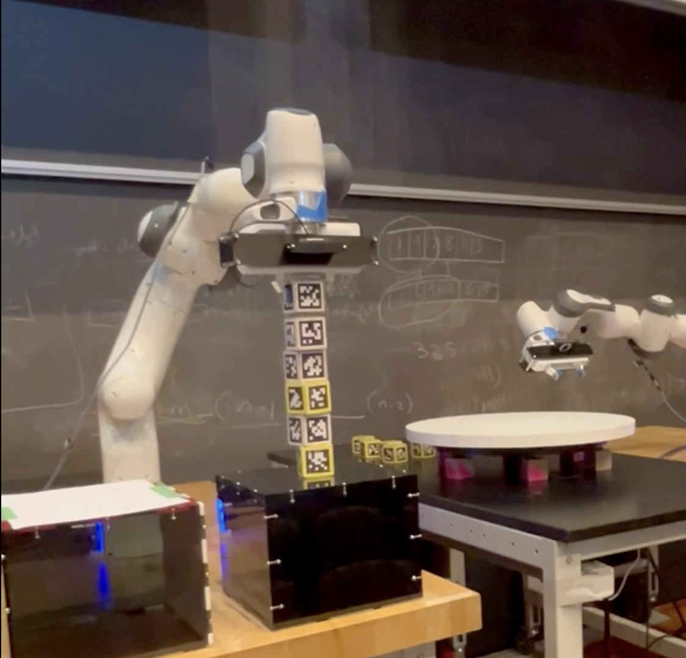

<div align="center">
<p align="center">
  
</p>
<p align="center">
    <h1 align="center">FrankaEmika_Pick_Place</h1>
</p>

<p align="center">
	
	
<p>
<p align="center">
	<!-- standard option, no dependency badges. -->
</p>
</div>
<hr>

## Introduction

This project represents an end to end pipeline for real-time 7 DOF robot to pick and place static and dynamic blocks using ROS and Gazebo framework. Developed motion planning using Geometric Inverse Kinematic and bi-directional RRT for tight and fast control.

## Project Overview
Objective: Develop a reliable and efficient pick-and-place system.
Technologies Used: Franka Emika robotic arm, Python, custom algorithms for object detection and Inverse Kinematics.

[](http://www.youtube.com/watch?v=kSgi1wVt54U)


## Features
Object detection and manipulation for static and dynamic objects.
Custom Inverse Kinematics for precise robot movements.
Integration of simulation and real-world testing.

## Methodology
Static Block Strategy: Detailed design for precise block handling.
Dynamic Block Strategy: 'Fishing' method for dynamic picking.
Evaluation and Testing: Simulation and hardware testing for effectiveness validation.

##  Repository Structure

```sh
└── FrankaEmika_Pick_Place/
    ├── labs/
    │   ├── Forward_Kinematics/
    │   │   ├── visualize.py
    │   │   └── workspace.py
    │   ├── Inverse_Kinematics/
    │   │   ├── follow.py
    │   │   └── visualize.py
    │   ├── Jacobian_Velocity_FK/
    │   │   ├── follow.py
    │   │   └── visualize.py
    │   ├── Path Planning/
    │   │   ├── potentialField_demo.py
    │   │   └── rrt_demo.py
    │   └── Pick_Place_Final/
    │       ├── Final_Blue.py
    │       ├── Final_Red.py
    │       ├── Ik_new.py
    │       └── translib.py
    ├── lib/
    │   ├── FK_velocity.py
    │   ├── IK_position_null.py
    │   ├── IK_velocity_null.py
    │   ├── Jacobian.py
    │   ├── calcAngDiff.py
    │   ├── calcManipulability.py
    │   ├── detectCollision.py
    │   ├── forwardKinematics.py
    │   ├── inverseKinematics.py
    │   ├── loadmap.py
    │   ├── potentialFieldPlanner.py
    │   └── rrt.py
    |__ Report 
```

---

##  Modules


<details closed><summary>labs.Path Planning</summary>

| File                                                                                                                               | Summary                                                                   |
| ---                                                                                                                                | ---                                                                       |
| [potentialField_demo.py](https://github.com/Tejendra00/FrankaEmika_Pick_Place/blob/main/labs/Path Planning/potentialField_demo.py) | Error generating summary: HTTPStatusError occurred. See logs for details. |
| [rrt_demo.py](https://github.com/Tejendra00/FrankaEmika_Pick_Place/blob/main/labs/Path Planning/rrt_demo.py)                       | Error generating summary: HTTPStatusError occurred. See logs for details. |

</details>

<details closed><summary>labs.Forward_Kinematics</summary>

| File                                                                                                                | Summary                                                                   |
| ---                                                                                                                 | ---                                                                       |
| [visualize.py](https://github.com/Tejendra00/FrankaEmika_Pick_Place/blob/main/labs/Forward_Kinematics/visualize.py) | Error generating summary: HTTPStatusError occurred. See logs for details. |
| [workspace.py](https://github.com/Tejendra00/FrankaEmika_Pick_Place/blob/main/labs/Forward_Kinematics/workspace.py) | Error generating summary: HTTPStatusError occurred. See logs for details. |

</details>

<details closed><summary>labs.Jacobian_Velocity_FK</summary>

| File                                                                                                                  | Summary                                                                   |
| ---                                                                                                                   | ---                                                                       |
| [follow.py](https://github.com/Tejendra00/FrankaEmika_Pick_Place/blob/main/labs/Jacobian_Velocity_FK/follow.py)       | Error generating summary: HTTPStatusError occurred. See logs for details. |
| [visualize.py](https://github.com/Tejendra00/FrankaEmika_Pick_Place/blob/main/labs/Jacobian_Velocity_FK/visualize.py) | Error generating summary: HTTPStatusError occurred. See logs for details. |

</details>

<details closed><summary>labs.Pick_Place_Final</summary>

| File                                                                                                                | Summary                                                                   |
| ---                                                                                                                 | ---                                                                       |
| [Ik_new.py](https://github.com/Tejendra00/FrankaEmika_Pick_Place/blob/main/labs/Pick_Place_Final/Ik_new.py)         | Error generating summary: HTTPStatusError occurred. See logs for details. |
| [Final_Blue.py](https://github.com/Tejendra00/FrankaEmika_Pick_Place/blob/main/labs/Pick_Place_Final/Final_Blue.py) | Error generating summary: HTTPStatusError occurred. See logs for details. |
| [Final_Red.py](https://github.com/Tejendra00/FrankaEmika_Pick_Place/blob/main/labs/Pick_Place_Final/Final_Red.py)   | Error generating summary: HTTPStatusError occurred. See logs for details. |
| [translib.py](https://github.com/Tejendra00/FrankaEmika_Pick_Place/blob/main/labs/Pick_Place_Final/translib.py)     | Error generating summary: HTTPStatusError occurred. See logs for details. |

</details>

<details closed><summary>labs.Inverse_Kinematics</summary>

| File                                                                                                                | Summary                                                                   |
| ---                                                                                                                 | ---                                                                       |
| [follow.py](https://github.com/Tejendra00/FrankaEmika_Pick_Place/blob/main/labs/Inverse_Kinematics/follow.py)       | Error generating summary: HTTPStatusError occurred. See logs for details. |
| [visualize.py](https://github.com/Tejendra00/FrankaEmika_Pick_Place/blob/main/labs/Inverse_Kinematics/visualize.py) | Error generating summary: HTTPStatusError occurred. See logs for details. |

</details>

<details closed><summary>lib</summary>

| File                                                                                                                    | Summary                                                                   |
| ---                                                                                                                     | ---                                                                       |
| [FK_velocity.py](https://github.com/Tejendra00/FrankaEmika_Pick_Place/blob/main/lib/FK_velocity.py)                     | Error generating summary: HTTPStatusError occurred. See logs for details. |
| [loadmap.py](https://github.com/Tejendra00/FrankaEmika_Pick_Place/blob/main/lib/loadmap.py)                             | Error generating summary: HTTPStatusError occurred. See logs for details. |
| [Jacobian.py](https://github.com/Tejendra00/FrankaEmika_Pick_Place/blob/main/lib/Jacobian.py)                           | Error generating summary: HTTPStatusError occurred. See logs for details. |
| [potentialFieldPlanner.py](https://github.com/Tejendra00/FrankaEmika_Pick_Place/blob/main/lib/potentialFieldPlanner.py) | Error generating summary: HTTPStatusError occurred. See logs for details. |
| [inverseKinematics.py](https://github.com/Tejendra00/FrankaEmika_Pick_Place/blob/main/lib/inverseKinematics.py)         | Error generating summary: HTTPStatusError occurred. See logs for details. |
| [IK_position_null.py](https://github.com/Tejendra00/FrankaEmika_Pick_Place/blob/main/lib/IK_position_null.py)           | Error generating summary: HTTPStatusError occurred. See logs for details. |
| [IK_velocity_null.py](https://github.com/Tejendra00/FrankaEmika_Pick_Place/blob/main/lib/IK_velocity_null.py)           | Error generating summary: HTTPStatusError occurred. See logs for details. |
| [forwardKinematics.py](https://github.com/Tejendra00/FrankaEmika_Pick_Place/blob/main/lib/forwardKinematics.py)         | Error generating summary: HTTPStatusError occurred. See logs for details. |
| [calcAngDiff.py](https://github.com/Tejendra00/FrankaEmika_Pick_Place/blob/main/lib/calcAngDiff.py)                     | Error generating summary: HTTPStatusError occurred. See logs for details. |
| [calcManipulability.py](https://github.com/Tejendra00/FrankaEmika_Pick_Place/blob/main/lib/calcManipulability.py)       | Error generating summary: HTTPStatusError occurred. See logs for details. |
| [detectCollision.py](https://github.com/Tejendra00/FrankaEmika_Pick_Place/blob/main/lib/detectCollision.py)             | Error generating summary: HTTPStatusError occurred. See logs for details. |
| [__init__](https://github.com/Tejendra00/FrankaEmika_Pick_Place/blob/main/lib/__init__)                                 | Error generating summary: HTTPStatusError occurred. See logs for details. |
| [rrt.py](https://github.com/Tejendra00/FrankaEmika_Pick_Place/blob/main/lib/rrt.py)                                     | Error generating summary: HTTPStatusError occurred. See logs for details. |

</details>
---

##  License

This project is protected under the [MIT] License. For more details, refer to the [LICENSE](https://choosealicense.com/licenses/mit/) file.

---

